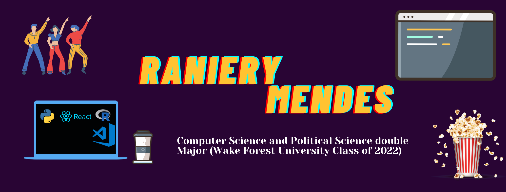

<td></td>  

<td>  </td>

<td>  </td>

 ### Hi there!
  
  
  
  📫 How to reach me:

  <a href="https://www.linkedin.com/in/raniery-mendes"> </img> Raniery Mendes</a> 
  
  
 <a>    mendrc18@wfu.edu</a>
 
 
  
  😄 Pronouns: he/him/his
<!--
**RanieryMendes/RanieryMendes** is a ✨ _special_ ✨ repository because its `README.md` (this file) appears on your GitHub profile.

Here are some ideas to get you started:

- 🔭 I’m currently working on ...
- 🌱 I’m currently learning ...
- 👯 I’m looking to collaborate on ...
- 🤔 I’m looking for help with ...
- 💬 Ask me about ...
- 📫 How to reach me: ...
- 
- ⚡ Fun fact:
-->
